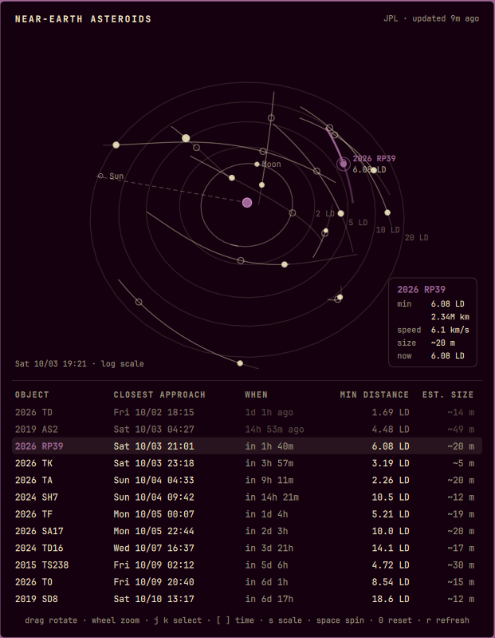

# Asteroid Radar

A bar widget for Omarchy that shows near-Earth asteroids passing close to Earth
this week. The bar pill shows how far away the next close approach will be. The
panel draws every pass in 3D around Earth and the Moon, and you can rotate it.



## Features

- **Bar pill:** distance of the next close approach, e.g. `6.1LD`. It switches
  to the bar's active colour when something will pass inside the Moon's orbit
  within the next two days.
- **3D radar:** Earth, the Moon's orbit, the direction of the Sun, and distance
  rings on the ecliptic plane. Each asteroid's track is drawn over the days
  around its approach: the part already travelled is faint, the part still to
  come is bright, and a small ring marks the closest point. Dot size follows the
  estimated diameter.
- **Info card:** minimum distance (in lunar distances and km), relative speed,
  estimated size, and the current distance of the selected object.
- **Approach list:** when each object makes its closest approach, in your local
  time and as a countdown, plus minimum distance and estimated size.
- **Time scrub:** step the whole scene forward or back three hours at a time to
  watch the passes play out.

## Install

```bash
omarchy plugin add https://github.com/mechurisr/omarchy-asteroid-radar.git --enable
```

## Controls

| Input | Action |
|---|---|
| Left click on the pill | Open or close the panel |
| Middle click on the pill | Fetch fresh data |
| Drag | Rotate |
| Wheel, `+` / `-` | Zoom |
| `j` / `k`, click a dot or a row | Select an object |
| `h` / `l` | Rotate left / right |
| `[` / `]` | Move time back / forward by 3 hours |
| `s` | Switch between log and linear distance scale |
| `Space` | Toggle auto-rotation |
| `0` | Reset the view and time |
| `r` | Fetch fresh data |
| `Esc` | Close |

Auto-rotation stops 20 seconds after the panel opens or after you last touch it,
so a panel left open does not keep redrawing.

## Settings

| Key | Default | Meaning |
|---|---|---|
| `refreshHours` | `6` | How often to fetch new data |
| `maxDistanceLd` | `20` | Only list approaches closer than this many lunar distances |
| `maxObjects` | `15` | Upper limit on objects shown, nearest first |

## Data

Both sources are free public APIs from NASA JPL and need no API key.

- [SBDB Close-Approach Data API](https://ssd-api.jpl.nasa.gov/doc/cad.html):
  objects passing within `maxDistanceLd` between yesterday and a week from now.
- [Horizons API](https://ssd-api.jpl.nasa.gov/doc/horizons.html): geocentric
  ecliptic position vectors for each object around its approach, plus the Moon's
  orbit and the Sun's direction. Requests go one at a time, as Horizons asks.

One fetch runs every `refreshHours` and is cached in
`~/.cache/omarchy-asteroid-radar.json`. Positions between samples are
interpolated locally, so opening the panel makes no network requests.

Distances are in lunar distances (1 LD = 384,400 km). Sizes are estimated from
absolute magnitude with an assumed albedo of 0.14, so treat them as accurate to
within about a factor of two. Measured diameters are used when JPL has one.

## IPC

```bash
qs -p /usr/share/omarchy/shell ipc call mechurisr.asteroid-radar open|close|toggle|refresh|status
qs -p /usr/share/omarchy/shell ipc call mechurisr.asteroid-radar spin on|off|toggle
```

## Requirements

`curl`, which a stock Omarchy install already has. Rendering uses
`QtQuick.Shapes`, which ships with Qt, so nothing else needs installing.

## License

MIT
